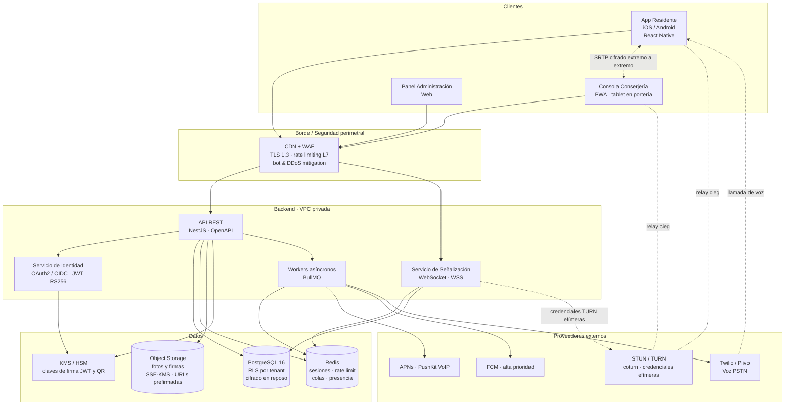
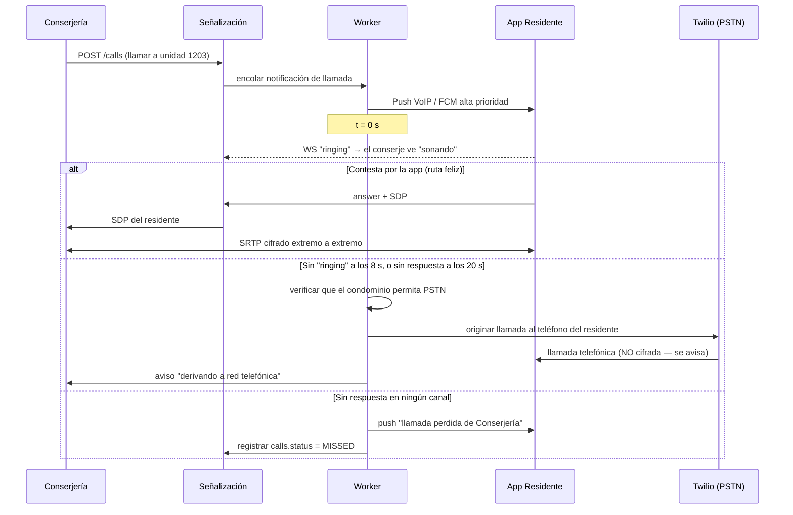

# 1. Arquitectura del Sistema

## 1.1 Advertencia previa sobre el requisito "Cero Hackeos"

Antes del diseño, una precisión profesional: **ningún sistema conectado es inhackeable**, y prometerlo por contrato es un riesgo legal y de reputación. Lo que sí es alcanzable —y es lo que este diseño persigue— son tres propiedades medibles:

1. **Defensa en profundidad**: que un fallo aislado (un bug en un handler, una credencial filtrada) no baste para comprometer datos. Por eso el aislamiento multi-tenant se implementa dos veces, en la aplicación *y* en la base de datos con RLS.
2. **Radio de explosión acotado**: que comprometer la cuenta de un conserje no exponga otro condominio, y que comprometer el servidor de señalización no permita escuchar audio.
3. **Trazabilidad no repudiable**: que toda acción crítica quede en un registro que ni el administrador de la plataforma pueda reescribir sin dejar evidencia.

El resto del documento es explícito sobre dónde **no** se alcanza la garantía ideal (notablemente el fallback a PSTN, ver §1.4).

## 1.2 Diagrama de componentes

**Lectura clave del diagrama**: la línea de audio entre la app y la consola de conserjería **no pasa por el backend**. El backend sólo intercambia metadatos de señalización (SDP/ICE). Esa separación es lo que hace que el cifrado sea realmente de extremo a extremo.

## 1.3 Decisiones de arquitectura y su justificación

| Componente | Elección | Por qué |
|---|---|---|
| App móvil | React Native + módulos nativos | Un solo equipo para iOS/Android. La citofonía **exige** código nativo de todos modos (CallKit / ConnectionService), que se encapsula en módulos propios. |
| Consola conserjería | PWA en tablet/PC de portería | La portería tiene pantalla fija y buena red. Una PWA se actualiza sin tienda de aplicaciones, crítico para parchear rápido. |
| Backend | NestJS (TypeScript) | Módulos, DI y `guards` declarativos: el control de acceso se expresa como decorador por endpoint, lo que hace auditable de un vistazo qué permiso exige cada ruta. |
| API | REST + OpenAPI (no GraphQL en el MVP) | GraphQL amplía la superficie de ataque (consultas anidadas, complejidad, IDOR por resolvers) justo en el módulo donde el aislamiento es crítico. Se evalúa GraphQL post-MVP y sólo para reportería del panel de administración. |
| Base de datos | PostgreSQL 16 con RLS | RLS convierte el aislamiento de tenants en una propiedad del motor, no en disciplina del programador. Ver `db/schema.sql`. |
| Media | WebRTC P2P, **sin SFU** | Un SFU obligaría a terminar el cifrado en el servidor. Las llamadas son 1:1, así que P2P es suficiente y preserva el E2EE. |
| Señalización | WebSocket propio | Necesita autenticación por JWT, presencia por unidad y enrutamiento por tenant; ningún servicio genérico lo hace con la granularidad de RBAC requerida. |
| Colas | Redis + BullMQ | El fan-out de push, los temporizadores de fallback PSTN y el procesamiento de imágenes deben salir del ciclo de petición. |

## 1.4 Cifrado de audio: alcance real del E2EE

**Lo que sí se logra.** WebRTC negocia las claves de media por **DTLS-SRTP**: los pares intercambian material de clave directamente y cifran el RTP con SRTP. El backend de señalización transporta los SDP, que contienen sólo la **huella (fingerprint) del certificado DTLS**, no la clave. Un atacante que controle por completo el servidor de señalización **no puede descifrar el audio**; sólo puede intentar un *man-in-the-middle* sustituyendo huellas, y para eso está la mitigación del párrafo siguiente. El servidor TURN, cuando se necesita relay, reenvía paquetes SRTP ya cifrados: es un relay ciego.

**Mitigación del MITM en señalización.** Como el servidor podría intercambiar las huellas DTLS de ambos lados, la app y la consola **firman su huella DTLS** con la clave del dispositivo registrada al enrolarse, y verifican la firma del par contra la clave pública que entrega el backend. Esto reduce el ataque a un backend comprometido *que además* pueda firmar con claves de dispositivo que no posee.

**Lo que NO se logra, y hay que declararlo.**

- **El fallback a PSTN no es, ni puede ser, cifrado de extremo a extremo.** La llamada se termina en el gateway del operador (Twilio/Plivo) y viaja por la red telefónica: el proveedor tiene acceso al audio en claro por diseño. Ninguna configuración lo evita. Por eso:
  - El fallback PSTN es **opcional por condominio** (`condominiums.settings`) y desactivable.
  - Cuando una llamada cae a PSTN, **ambas partes ven un indicador visible de "línea no cifrada"** y el hecho queda registrado en `calls.fell_back_to_pstn`.
  - Se documenta en la política de privacidad. Presentar una llamada PSTN como "cifrada extremo a extremo" sería falso.
- **Si en el futuro se agregan llamadas grupales o portero con video multipunto**, un SFU rompe el E2EE salvo que se implemente SFrame / Insertable Streams. Queda fuera del MVP y anotado como decisión consciente.

## 1.5 Notificación de llamada entrante: el punto más frágil del producto

Que el teléfono suene con la app cerrada o en "No molestar" no es un problema de backend, es un problema de cumplir las reglas de cada sistema operativo. Es el requisito con más probabilidad de fallar en producción.

**iOS — PushKit VoIP + CallKit (obligatorio).**
- Se usa un push **PushKit VoIP**, no una notificación normal. Es el único canal que despierta la app aunque esté terminada.
- Desde iOS 13 el sistema **exige** que la app invoque `CXProvider.reportNewIncomingCall()` de forma inmediata al recibir el push. Si no lo hace, iOS mata el proceso y, tras varias faltas, **deja de entregar pushes VoIP a esa app**. Es la causa número uno de "la citofonía dejó de sonar".
- CallKit presenta la llamada como una llamada telefónica del sistema: suena sobre "No molestar" y ocupa la pantalla de bloqueo, que es exactamente el comportamiento pedido.
- Las *Critical Alerts* de Apple **no** son la herramienta correcta aquí: requieren una autorización especial de Apple, aplican a alertas y no a llamadas, y CallKit ya resuelve el caso.

**Android — FCM alta prioridad + full-screen intent.**
- Mensaje **de datos** con `priority: high` para atravesar Doze y App Standby.
- Al recibirlo, un *foreground service* muestra una notificación con `fullScreenIntent` y categoría `CATEGORY_CALL`, en un canal con `IMPORTANCE_HIGH`.
- Desde **Android 14**, `USE_FULL_SCREEN_INTENT` se concede automáticamente sólo a apps de llamadas o alarmas; hay que declarar la categoría correctamente y justificarlo en la ficha de Play. Se recomienda además integrar `ConnectionService`/`Telecom` para que el sistema trate la citofonía como llamada real.
- Los fabricantes chinos (Xiaomi, Huawei, Oppo) aplican gestores de batería agresivos: la app debe detectar la restricción y guiar al usuario a excluirla, además de depender del fallback PSTN como red de seguridad.

**Contenido del push.** Nunca lleva datos personales: sólo `call_id` y un identificador opaco. La app consulta el detalle autenticada. Así ni la pantalla de bloqueo ni los servidores de Apple/Google ven quién visita a quién.

**Cadena de escalamiento** (implementada como temporizadores en workers):

Los umbrales (8 s / 20 s) son configurables por condominio. La decisión de derivar a PSTN es del **servidor**, no del cliente: un cliente comprometido no puede forzar que se marque a un teléfono arbitrario, porque el número se toma de la base de datos según la unidad llamada, jamás de la petición.

## 1.6 Infraestructura recomendada

**Punto de partida (1–50 condominios).** Contenedores gestionados (AWS ECS Fargate, Google Cloud Run o Fly.io), PostgreSQL gestionado (RDS/Cloud SQL) con réplica y PITR, Redis gestionado, object storage con SSE-KMS. Esta escala **no justifica Kubernetes**: añade superficie de ataque y carga operativa sin beneficio.

**Red.** Base de datos y Redis en subredes privadas, sin IP pública. El único ingreso es el WAF. Salida a proveedores externos por NAT con lista blanca de destinos.

**TURN.** `coturn` propio en instancias con IP pública, escuchando en 443/TCP y UDP para atravesar redes corporativas restrictivas. Credenciales **efímeras** (usuario/contraseña derivados por HMAC con TTL de 5 minutos, RFC 8489), emitidas por el backend por llamada. Nunca credenciales estáticas embebidas en el cliente: es una fuga clásica que convierte tu TURN en un proxy abierto y en una factura de ancho de banda ajena.

**Secretos.** La clave privada RS256 de firma de JWT vive en KMS y **nunca sale**: el backend pide a KMS que firme. Así, volcar la memoria del servidor no entrega la clave. Rotación de claves de firma cada 90 días con publicación de JWKS y solapamiento por `kid`.

**Regionalidad.** Datos alojados en la región del condominio. Para Chile, considerar la Ley 21.719 de protección de datos personales (vigente desde diciembre de 2026): conviene fijar residencia de datos y un DPA con los proveedores desde el inicio, porque migrar después es caro.

**Observabilidad.** OpenTelemetry extremo a extremo con `request_id` propagado hasta `audit_logs.request_id`. Alertas sobre: tasa de fallo de entrega de push, proporción de llamadas derivadas a PSTN (indicador temprano de que la notificación se rompió tras una actualización de SO), intentos de validación de QR fallidos por portería, y roturas detectadas por `verify_audit_chain`.

## 1.7 Entornos y despliegue

Tres entornos (`dev`, `staging`, `prod`) con infraestructura como código (Terraform). Nadie tiene acceso permanente a producción: acceso *just-in-time* con aprobación y registro. Los despliegues son inmutables y con reversión en un paso, porque el modo de fallo más probable de este producto no es un ataque sino **un despliegue que rompe la notificación de llamadas**, y ahí el tiempo de recuperación es lo único que importa.
