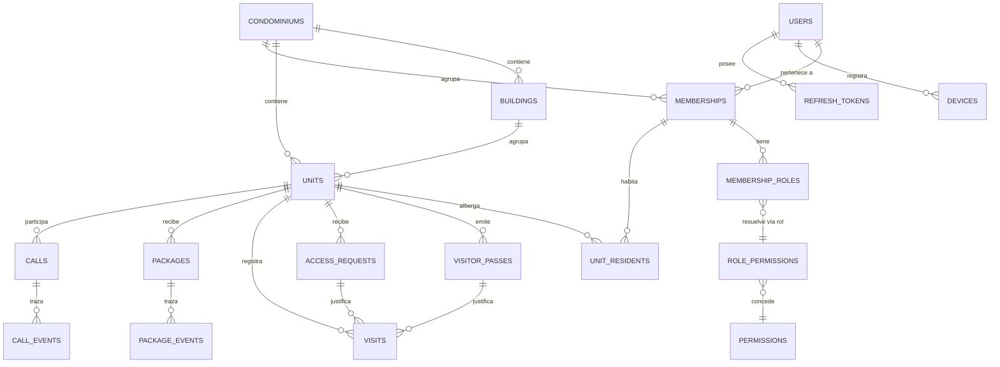

# 2. Modelo de Datos (PostgreSQL 16)

El esquema ejecutable está en **[`db/schema.sql`](../db/schema.sql)**. Las pruebas que verifican sus invariantes de seguridad están en **[`db/tests/security_invariants.sql`](../db/tests/security_invariants.sql)** (25 aserciones, todas en verde).

## 2.1 Diagrama entidad-relación



## 2.2 Las tres decisiones que sostienen el modelo

### a) `users` es global; `memberships` es el punto de anclaje del tenant

Una persona puede ser residente en dos condominios (o residente en uno y miembro del comité en otro). Si el usuario fuera hijo del condominio habría que duplicarlo, y con él sus credenciales y su MFA. En su lugar:

- `users` guarda la identidad y las credenciales, **una sola vez**.
- `memberships (condominium_id, user_id)` es único: una membresía por persona y condominio.
- Los roles cuelgan de la membresía (`membership_roles`), no del usuario. Por eso alguien puede ser `ADMIN` y `RESIDENTE` en el mismo edificio sin trucos.

Todo lo demás en el sistema referencia **membresías**, nunca usuarios. Así, revocar el acceso de un conserje despedido es borrar una fila y su acceso desaparece en ese condominio sin tocar su cuenta personal.

### b) Aislamiento multi-tenant por partida doble

**Capa 1 — Row Level Security.** Cada tabla de negocio lleva `condominium_id` y una política:

```sql
CREATE POLICY tenant_isolation ON app.units
  USING      (condominium_id = app.current_condominium_id())
  WITH CHECK (condominium_id = app.current_condominium_id());
```

El backend ejecuta `SET LOCAL app.condominium_id` al abrir cada transacción, con el valor tomado **del JWT verificado**, jamás de un parámetro de la petición. Si la variable no está definida, `current_setting(...)` devuelve `NULL`, ninguna fila cumple la condición y el acceso es **cero por defecto** (*fail-closed*). La prueba «Sin contexto de tenant el acceso es cero» verifica precisamente esto.

Se usa `FORCE ROW LEVEL SECURITY` para que la política aplique incluso al dueño de la tabla, y la aplicación se conecta con el rol `citofonia_app`, que no es superusuario ni tiene `BYPASSRLS`.

**Capa 2 — Claves foráneas compuestas.** RLS filtra lecturas, pero no impide que un `INSERT` enlace entidades de tenants distintos. Por eso las referencias arrastran el tenant:

```sql
UNIQUE (condominium_id, id)                        -- clave candidata compuesta
...
FOREIGN KEY (condominium_id, unit_id)
  REFERENCES app.units (condominium_id, id)
```

Con esto, registrar una encomienda del condominio A contra una unidad del condominio B **es imposible a nivel de motor**: no existe la tupla `(A, unidad_de_B)`. Es una defensa estructural contra IDOR que sobrevive a cualquier bug de la aplicación.

### c) Ningún secreto se almacena en claro

| Dato | Cómo se guarda | Por qué |
|---|---|---|
| Contraseña | `password_hash` — argon2id | Resistente a GPU/ASIC; es la recomendación actual de OWASP. |
| Refresh token | `token_hash` — SHA-256 | El token es de alta entropía, no necesita KDF lento; el hash basta para que un volcado de BD no dé sesiones. |
| Token del QR | `token_hash` — SHA-256 | El servidor no necesita el token, sólo verificar el que le presentan. |
| Código de retiro de encomienda | `pickup_code_hash` — HMAC | Códigos cortos (6 dígitos): el HMAC con clave del servidor impide reconstruirlos por fuerza bruta desde un volcado. |
| RUT / documento de identidad | `national_id_enc` + `national_id_hash` | Cifrado sobre KMS. El hash permite buscar por igualdad sin descifrar. |
| Secreto MFA | `mfa_secret_enc` | Cifrado con clave de KMS. |

La prueba «Ninguna columna guarda secretos en claro» recorre `information_schema` y falla si aparece una columna cuyo nombre sugiere secreto y no termina en `_hash` o `_enc`. Es una red de seguridad contra el descuido de mañana.

## 2.3 Entidades principales

### Control de acceso

**`visitor_passes`** — el pase QR. Campos clave: `key_id` (identifica la clave Ed25519 que lo firmó, para poder rotar), `token_hash`, `max_uses`/`used_count`, ventana `valid_from`/`valid_until` y `status`.

Dos restricciones deliberadas:
- `CHECK (valid_until <= valid_from + interval '7 days')` — un QR **no puede convertirse en un pase permanente**. Es el abuso más habitual en este tipo de producto: el residente emite un código "para siempre" para la persona que hace el aseo, y ese código termina circulando.
- `CHECK (used_count <= max_uses)` — el canje se hace con un `UPDATE ... WHERE status='ACTIVE' AND used_count < max_uses RETURNING`, que es atómico y elimina la condición de carrera de dos porterías escaneando el mismo QR a la vez.

**`access_requests`** — el flujo alternativo: el conserje pide autorización y el residente aprueba remotamente. El `CHECK` obliga a que `status IN ('APROBADA','RECHAZADA')` sea equivalente a tener `responded_by` y `responded_at`: no existe una aprobación sin un responsable identificado.

**`visits`** — la bitácora. Distingue `authorized_by` (el residente que autorizó) de `registered_by` (el conserje que ejecutó), que es la información que realmente se busca cuando hay un incidente. `method` registra la vía de ingreso, y `CHECK (method <> 'QR' OR pass_id IS NOT NULL)` impide falsificar a posteriori un ingreso "por QR" sin pase asociado.

### Encomiendas

**`packages`** modela la máquina de estados `RECIBIDA → NOTIFICADA → ENTREGADA` (más `DEVUELTA`/`EXTRAVIADA`). La restricción que importa:

```sql
CHECK (status <> 'ENTREGADA' OR (
  delivered_at IS NOT NULL AND delivered_by IS NOT NULL AND delivery_method IS NOT NULL
  AND (delivery_method <> 'FIRMA_DIGITAL'      OR signature_key    IS NOT NULL)
  AND (delivery_method <> 'AUTORIZADO_TERCERO' OR delivered_to_name IS NOT NULL)))
```

Traducido: **no se puede marcar una encomienda como entregada sin prueba de entrega**. Si el método fue firma digital, tiene que existir la firma. Si retiró un tercero, tiene que constar su nombre. Esto es lo que convierte el módulo en evidencia utilizable cuando un residente reclama un paquete que "nunca llegó". Tres pruebas cubren este caso.

El inventario en tiempo real se sirve con un índice parcial —`WHERE status IN ('RECIBIDA','NOTIFICADA')`— que se mantiene pequeño aunque la tabla histórica crezca a millones de filas.

### Citofonía

**`calls`** registra metadatos, **nunca audio**. No se graban llamadas por omisión: grabar convierte el sistema en un objetivo mucho más valioso y activa obligaciones legales de consentimiento. `duration_seconds` es una columna generada a partir de `answered_at`/`ended_at`, de modo que no puede desincronizarse. `fell_back_to_pstn` y `turn_relayed` alimentan las métricas de salud descritas en §1.6.

## 2.4 Auditoría inmutable

`audit_logs` es la pieza con más ingeniería del esquema, porque "inmutable" es fácil de decir y fácil de implementar mal.

**Append-only en dos niveles.** Se revocan `UPDATE`/`DELETE`/`TRUNCATE` al rol de la aplicación, y además un trigger `BEFORE UPDATE OR DELETE` lanza excepción. El trigger cubre el caso de que alguien se conecte con un rol privilegiado: ni el dueño de la tabla puede alterar el histórico por la vía normal.

**Encadenamiento de hash.** Cada entrada guarda `prev_hash` y `entry_hash = SHA256(prev_hash || campos canónicos)`. Borrar o alterar una entrada rompe la cadena de todas las posteriores, y `app.verify_audit_chain()` lo detecta. El verificador **recalcula** cada hash en lugar de sólo comparar enlaces, de modo que detecta también la modificación de un campo dentro de una entrada existente. Una prueba lo demuestra deshabilitando el trigger, alterando una fila directamente en la partición y comprobando que el verificador la delata.

**Dos detalles que se resolvieron durante la implementación** y que conviene registrar, porque son trampas reales:

1. **`created_at` no sirve para ordenar la cadena.** `now()` es constante dentro de una transacción, así que todas las entradas emitidas en una misma operación comparten timestamp y el orden queda indefinido. Se añadió un correlativo estricto `seq` por tenant.
2. **Un trigger `BEFORE INSERT` no ve las filas insertadas por su propia sentencia.** Consultar `audit_logs` para obtener el hash previo produce `prev_hash` duplicados en un `INSERT` multi-fila —y una cadena rota desde el primer día—. La solución es una tabla `audit_chain_heads` con una fila por tenant, leída con `FOR UPDATE`: da orden total y exclusión mutua, y los cambios de la propia transacción sí son visibles. La prueba correspondiente inserta tres entradas en una sola sentencia justamente para cubrir este caso.

`audit_chain_heads` se mantiene mediante un trigger `SECURITY DEFINER` y la cuenta de la aplicación **no tiene ningún permiso sobre ella**. Así, un atacante con ejecución de SQL arbitrario como `citofonia_app` no puede reescribir la cabeza de la cadena para fabricar un histórico coherente.

**Particionado.** `audit_logs` se particiona mensualmente por `created_at`. Las particiones antiguas se pueden mover a almacenamiento frío sin afectar el rendimiento de las consultas recientes.

**Anclaje externo (recomendado post-MVP).** Publicar diariamente el último `entry_hash` de cada tenant en un almacén externo de sólo-anexado (por ejemplo un bucket con Object Lock/WORM). Sin esto, quien tenga control total del motor podría recalcular la cadena completa. Con esto, tendría que además falsificar el ancla externa.

## 2.5 Matriz RBAC (mínimo privilegio)

Sembrada en `db/schema.sql` como datos en `permissions` y `role_permissions`. El criterio no fue "el administrador puede todo", sino **separación de funciones**:

| Rol | Alcance | Deliberadamente **no** puede |
|---|---|---|
| **ADMIN** | Gestión del condominio, unidades, miembros; lectura completa de bitácoras, inventario y auditoría; exportación. | Escanear QR, registrar visitas o entregar encomiendas. El administrador **no opera la portería**: si además cumpliera ese rol, se le concede explícitamente `CONSERJE`, y así queda registrado. |
| **CONSERJE** | Validar pases, registrar entradas/salidas, solicitar autorización, recibir y entregar encomiendas, llamar a unidades. | Leer los logs de auditoría, gestionar membresías o exportar datos. Un conserje comprometido no puede borrar sus huellas ni llevarse el padrón de residentes. |
| **RESIDENTE** | Todo limitado a **su** unidad: emitir y revocar pases, aprobar ingresos, ver sus visitas y encomiendas, contestar y originar llamadas. | Ver datos de otras unidades, ni siquiera del mismo edificio. |
| **VISITA** | Consultar su propio pase mediante el token firmado. | Cualquier acceso a datos del condominio. No es una cuenta completa. |

El permiso se resuelve en la petición como `permisos(roles(membresía)) ∩ alcance(recurso)`. El sufijo `.own_unit` no es decorativo: el `guard` correspondiente comprueba que el recurso pertenezca a una unidad donde el solicitante figure en `unit_residents` con vigencia activa.

## 2.6 Retención de datos

| Dato | Retención sugerida | Motivo |
|---|---|---|
| Bitácora de visitas | 12 meses | Utilidad operativa y de investigación. |
| Fotos de visitantes y de paquetes | 90 días | Son biométricamente sensibles; borrado automático del objeto. |
| Registros de llamadas (metadatos) | 12 meses | Facturación PSTN y diagnóstico. |
| Encomiendas entregadas | 24 meses | Respaldo ante reclamos. |
| `audit_logs` | 24 meses en línea, 5 años en frío | Trazabilidad; requisito habitual de auditoría. |
| Refresh tokens revocados | 90 días | Investigación de reuso de tokens. |

La purga corre como job programado y **queda registrada en la propia auditoría**: un borrado por retención es también un evento auditable.

## 2.7 Ejecutar el esquema y sus pruebas

```bash
createdb citofonia
psql -d citofonia -v ON_ERROR_STOP=1 -f db/schema.sql
psql -d citofonia -v ON_ERROR_STOP=1 -f db/tests/security_invariants.sql
```

Las pruebas son re-ejecutables (cada corrida se marca con un identificador propio, ya que las filas de auditoría de corridas anteriores no se pueden borrar por diseño). La salida esperada son 25 líneas `PASS` y `Todas las pruebas de invariantes pasaron.`; cualquier fallo aborta con el detalle. Este archivo debe correr en CI: es la red que impide que una migración futura desactive el aislamiento sin que nadie lo note.
