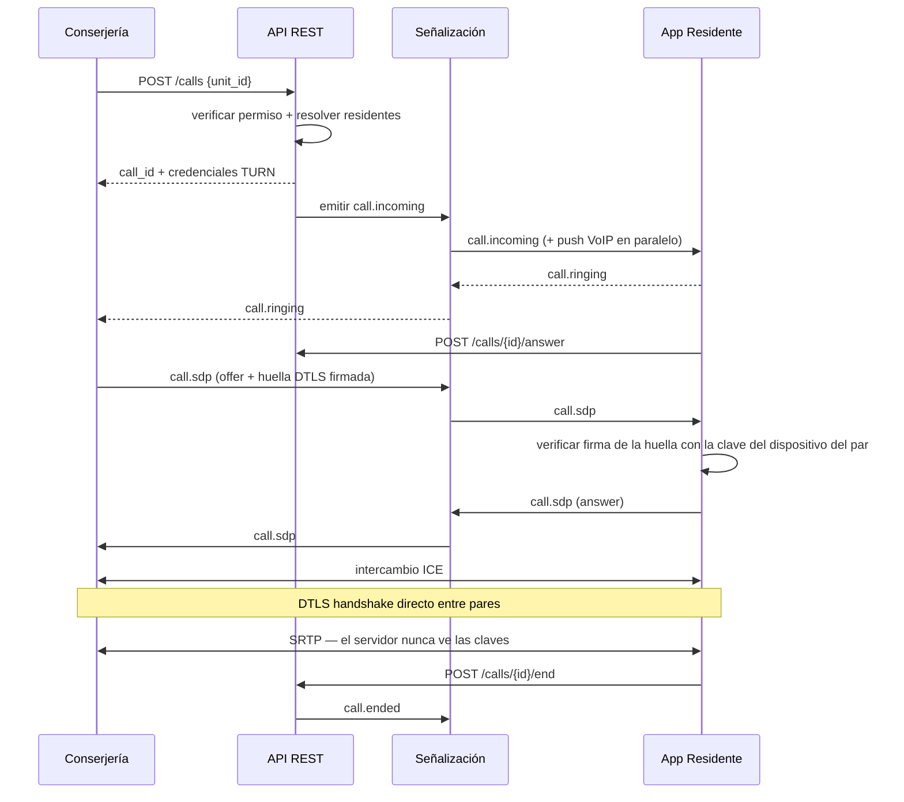

# 3. Especificación de API

Contrato formal en **[`api/openapi.yaml`](../api/openapi.yaml)**. Este documento explica las decisiones detrás de él y cubre lo que OpenAPI no describe: WebSocket y señalización WebRTC.

## 3.1 Convenciones transversales

- Base: `https://api.citofonia.cl/v1`. TLS 1.3, HSTS con `preload`.
- Autenticación: `Authorization: Bearer <access_token>` (JWT RS256, TTL 15 min).
- **El `condominium_id` nunca viaja en la petición.** Va dentro del token. Un endpoint que aceptara el tenant como parámetro sería un IDOR esperando a ocurrir.
- Todo identificador expuesto es UUIDv4. No hay enteros correlativos en ninguna URL.
- Mutaciones con `Idempotency-Key` obligatoria: registrar una encomienda dos veces por un reintento de red es un fallo real de portería.
- Paginación por cursor (`?cursor=&limit=`), máximo 100. Sin `OFFSET`: es caro y filtra el tamaño total.
- Errores en formato RFC 9457 (`application/problem+json`), sin filtrar detalles internos.
- Toda respuesta lleva `X-Request-Id`, que se propaga hasta `audit_logs.request_id`.

## 3.2 Autenticación e identidad

| Método | Ruta | Descripción | Límite |
|---|---|---|---|
| `POST` | `/auth/login` | Credenciales → tokens. Segundo factor si está activo. | 5 / 15 min por IP **y** por cuenta |
| `POST` | `/auth/mfa/verify` | Verifica el segundo factor. | 5 / 15 min |
| `POST` | `/auth/refresh` | Rota el refresh token. | 60 / hora por familia |
| `POST` | `/auth/logout` | Revoca la familia de tokens del dispositivo. | — |
| `POST` | `/auth/password/forgot` | Inicia recuperación. **Respuesta siempre idéntica**, exista o no la cuenta. | 3 / hora por IP |
| `POST` | `/auth/password/reset` | Consuma el token de un solo uso. | 5 / hora |
| `GET` | `/auth/.well-known/jwks.json` | Claves públicas de verificación. | — |
| `GET` | `/me` | Perfil, membresías y permisos efectivos. | — |
| `POST` | `/me/devices` | Registra el dispositivo y sus tokens de push. | 10 / hora |
| `DELETE` | `/me/devices/{id}` | Revoca un dispositivo. | — |

**Estructura del access token.** Contiene `sub` (usuario), `cid` (condominio activo), `mid` (membresía), `roles`, `perms`, `jti`, `iat`, `exp`, `aud`, `iss`. Los permisos se incluyen en el token para evitar una consulta por petición, con el costo aceptado de que **una revocación tarda hasta 15 minutos en propagarse**. Para revocación inmediata en incidentes existe una lista de denegación por `jti` y por membresía en Redis, consultada sólo en endpoints sensibles (validar QR, entregar encomienda, gestionar miembros).

**Rotación de refresh tokens con detección de reuso.** Cada refresh emite uno nuevo y marca el anterior como `rotated_to`. Si llega un token ya rotado, se asume robo y se **revoca la familia completa**, obligando a reautenticar en todos los dispositivos; el evento se audita y se notifica al usuario. El almacenamiento en el cliente es Keychain en iOS (`kSecAttrAccessibleAfterFirstUnlockThisDeviceOnly`) y Keystore/EncryptedSharedPreferences respaldado por hardware en Android. En la consola web, el refresh token va en cookie `HttpOnly; Secure; SameSite=Strict`, nunca en `localStorage`.

## 3.3 Pases QR y control de acceso

| Método | Ruta | Permiso |
|---|---|---|
| `POST` | `/units/{unitId}/passes` | `pass.create.own_unit` |
| `GET` | `/units/{unitId}/passes` | `pass.read.own_unit` |
| `DELETE` | `/passes/{passId}` | `pass.revoke.own_unit` |
| `POST` | `/passes/validate` | `pass.validate` (conserjería) |
| `POST` | `/access-requests` | `access_request.create` |
| `POST` | `/access-requests/{id}/respond` | `access_request.respond.own_unit` |
| `GET` | `/visits` | `visit.read.condominium` \| `.own_unit` |
| `POST` | `/visits` | `visit.create` |
| `POST` | `/visits/{id}/exit` | `visit.close` |

### Formato del token QR

```
CV1.<payload-base64url>.<firma-base64url>
```

`payload` es CBOR compacto:

| Campo | Contenido |
|---|---|
| `v` | versión del formato |
| `jti` | UUID del pase (`visitor_passes.id`) |
| `cid` | condominio |
| `uid` | unidad |
| `nbf` / `exp` | ventana de validez |
| `n` | usos permitidos |
| `kid` | identificador de la clave firmante |

**Se firma con Ed25519, no con RS256.** La razón es física: una firma RSA-2048 ocupa 256 bytes (≈342 caracteres en base64url), lo que empuja el QR a versiones muy densas —difíciles de leer con la cámara de una tablet, en un hall con poca luz y a través de un vidrio—. Ed25519 firma en 64 bytes y mantiene el QR en una versión cómoda que escanea al primer intento. RS256 se conserva para los JWT de la API, donde el tamaño es irrelevante y el requisito lo pide explícitamente.

### Validación en portería

`POST /passes/validate` con `{ "token": "CV1...." }`:

1. Parsear y verificar la firma Ed25519 con la clave pública de `kid`. **Este paso funciona sin conexión**, lo que permite modo degradado si cae internet en la portería.
2. Verificar `nbf`/`exp` con margen de reloj de ±60 s.
3. Comprobar que `cid` coincide con el condominio del token del conserje. Si no, se rechaza y **se audita como intento de acceso cruzado**: un QR de otro condominio presentado aquí es una señal de ataque, no un error del usuario.
4. Canje atómico:
   ```sql
   UPDATE app.visitor_passes
      SET used_count = used_count + 1,
          status = CASE WHEN used_count + 1 >= max_uses THEN 'USED' ELSE status END
    WHERE id = $1 AND condominium_id = $2 AND status = 'ACTIVE'
      AND used_count < max_uses AND now() BETWEEN valid_from AND valid_until
   RETURNING *;
   ```
   Cero filas devueltas ⇒ rechazo. Esto elimina la carrera entre dos porterías escaneando el mismo código simultáneamente.
5. Crear la `visit` con `method = 'QR'` y responder con nombre del visitante, unidad y foto si existe, para que el conserje contraste con la persona que tiene delante.

**Límite de intentos**: 10 validaciones fallidas por minuto y por portería. Un bombardeo de tokens inválidos es un ataque de fuerza bruta sobre firmas y debe alertar.

**Riesgo residual que no se elimina con criptografía.** Un residente puede tomar una captura del QR y enviarla por WhatsApp a alguien no autorizado. Ninguna firma lo impide. Las mitigaciones son de producto: TTL corto (por omisión 4 h, máximo 7 días por restricción de la base de datos), un solo uso por omisión, el nombre del visitante visible para que el conserje coteje, y —para condominios que lo requieran— un modo de alta seguridad donde el QR se re-genera cada 30 segundos en la app del residente y el visitante debe estar acompañado.

## 3.4 Citofonía

| Método | Ruta | Descripción |
|---|---|---|
| `POST` | `/calls` | Inicia una llamada hacia una unidad. Devuelve `call_id` y credenciales TURN efímeras. |
| `POST` | `/calls/{id}/answer` | El residente acepta. |
| `POST` | `/calls/{id}/reject` | El residente rechaza. |
| `POST` | `/calls/{id}/end` | Cualquiera de las partes cuelga. |
| `GET` | `/calls` | Historial. |
| `POST` | `/calls/{id}/quality` | El cliente reporta métricas al terminar. |
| `POST` | `/webhooks/twilio/voice` | Callback del proveedor PSTN. **Firma verificada obligatoriamente.** |

`POST /calls` recibe `{ "unit_id": "..." }` y **no** un número de teléfono ni un identificador de destino arbitrario. El servidor resuelve a quién notificar consultando `unit_residents` con `receives_calls = true`. Un cliente comprometido no puede hacer que la plataforma marque a un número elegido por él: el vector de fraude telefónico queda cerrado por diseño.

Las credenciales TURN se emiten por llamada, con TTL de 5 minutos y derivadas por HMAC (RFC 8489). No hay credenciales TURN estáticas en el cliente.

El webhook de Twilio valida la firma `X-Twilio-Signature` **antes** de leer el cuerpo, y el endpoint acepta tráfico sólo desde los rangos IP publicados por el proveedor. Un webhook de telefonía sin verificar es una forma directa de inyectar eventos falsos de llamada.

## 3.5 WebSocket y señalización WebRTC

Endpoint único: `wss://rt.citofonia.cl/v1/ws`.

**Handshake.** El token va en el subprotocolo (`Sec-WebSocket-Protocol: bearer,<token>`), no en la query string: las URLs quedan en logs de proxies y balanceadores. Se valida antes de aceptar la conexión. El socket se une automáticamente a los canales `tenant:{cid}`, `unit:{unitId}` (por cada unidad del usuario) y `user:{userId}`. **El cliente no puede pedir suscripción a un canal arbitrario**; la suscripción se deriva del token en el servidor.

**Eventos servidor → cliente**

| Evento | Destino | Contenido |
|---|---|---|
| `call.incoming` | unidad | `call_id`, origen, `turn_credentials` |
| `call.ringing` / `call.answered` / `call.ended` | ambos | cambio de estado |
| `call.sdp` / `call.ice` | par | señalización WebRTC |
| `call.fallback_pstn` | ambos | aviso de derivación a línea **no cifrada** |
| `access_request.created` | unidad | solicitud de autorización pendiente |
| `access_request.resolved` | conserjería | resultado |
| `package.registered` | unidad | encomienda recibida |
| `visit.registered` | unidad | ingreso registrado |

**Eventos cliente → servidor**: `call.sdp`, `call.ice`, `call.ringing`, `heartbeat`.

**Protecciones**: 50 mensajes/segundo por conexión, tamaño máximo 64 KB, `heartbeat` cada 30 s con desconexión a los 90 s, y un tope de conexiones simultáneas por usuario. Los payloads de SDP/ICE se validan estructuralmente antes de reenviarse: el servidor **no** actúa de tubería ciega entre clientes, porque reenviar SDP arbitrario es un vector de ataque contra el par receptor.

### Flujo de señalización



El paso de verificación de la huella DTLS firmada es lo que impide que un servidor de señalización comprometido monte un *man-in-the-middle* sustituyendo huellas (ver §1.4).

## 3.6 Encomiendas

| Método | Ruta | Permiso |
|---|---|---|
| `POST` | `/packages` | `package.create` |
| `GET` | `/packages` | `package.read.condominium` \| `.own_unit` |
| `GET` | `/packages/{id}` | idem |
| `POST` | `/packages/{id}/deliver` | `package.deliver` |
| `POST` | `/packages/{id}/photo` | `package.create` — devuelve URL prefirmada |
| `GET` | `/packages/inventory` | inventario agregado con filtros |

`GET /packages` acepta `status`, `unit_id`, `from`, `to`, `carrier`. Para un `RESIDENTE` el filtro por unidad se **impone en el servidor** a partir de sus `unit_residents`; el parámetro que envíe el cliente se ignora si excede su alcance.

**Subida de imágenes.** El cliente pide una URL prefirmada (TTL 5 min, `Content-Type` y tamaño máximo fijados en la firma) y sube directo al object storage. Los archivos se sirven también por URL prefirmada de corta vida: **nunca hay un bucket público**. Un worker valida que el archivo sea realmente una imagen (por *magic bytes*, no por extensión), la re-codifica para eliminar metadatos EXIF —incluida la geolocalización— y genera miniatura.

**Entrega.** `POST /packages/{id}/deliver` acepta `delivery_method` con tres variantes: `CODIGO_RETIRO` (se compara el HMAC del código contra `pickup_code_hash`, con límite de 5 intentos por paquete), `FIRMA_DIGITAL` (imagen de la firma capturada en pantalla) o `AUTORIZADO_TERCERO` (exige nombre de quien retira). La base de datos rechaza cualquier transición a `ENTREGADA` sin la prueba correspondiente, de modo que un error de la aplicación no puede producir una entrega sin respaldo.

## 3.7 Auditoría y reportes

| Método | Ruta | Permiso |
|---|---|---|
| `GET` | `/audit-logs` | `audit.read.condominium` |
| `GET` | `/audit-logs/verify` | `audit.read.condominium` — ejecuta `verify_audit_chain` |
| `POST` | `/reports/visits` | `report.export.condominium` |
| `POST` | `/reports/packages` | `report.export.condominium` |

Las exportaciones se generan en background y se entregan por URL prefirmada de un solo uso. **Toda exportación se audita**: la extracción masiva de datos personales es exactamente el evento que interesa detectar.

## 3.8 Defensas OWASP por endpoint

| Riesgo | Dónde se ataja |
|---|---|
| **A01 Broken Access Control / IDOR** | RLS + FK compuestas en la base de datos (§2.2), `guards` por permiso, tenant tomado del token y no de la petición, UUIDv4 en todas las URLs. |
| **A02 Fallos criptográficos** | TLS 1.3, argon2id, cifrado en reposo con KMS, DTLS-SRTP para media, secretos sólo como hash. |
| **A03 Inyección** | Consultas parametrizadas exclusivamente; validación de esquema en el borde con `zod`; sin SQL dinámico con entrada de usuario. |
| **A04 Diseño inseguro** | Modelo de amenazas por módulo antes de codificar (fase 0 del plan); límites de negocio en la base de datos (TTL del pase, prueba de entrega). |
| **A05 Configuración incorrecta** | IaC revisada, CSP estricta, cabeceras de seguridad, sin buckets públicos, verificación de configuración en CI. |
| **A07 Fallos de identificación** | Rotación de refresh con detección de reuso, MFA obligatorio para ADMIN y CONSERJE, bloqueo progresivo, límites por cuenta y por IP. |
| **A08 Fallos de integridad** | Dependencias fijadas con *lockfile* y verificación de firma, SBOM por build, imágenes firmadas con cosign. |
| **A09 Fallos de registro** | `audit_logs` encadenado e inmutable, alertas sobre patrones anómalos. |
| **A10 SSRF** | Sin obtención de URLs provistas por el usuario; egreso con lista blanca de destinos. |
| **XSS** | React con escapado por defecto, CSP sin `unsafe-inline`, sanitización de todo texto libre (nombre de visitante, notas) al renderizar. |
| **CSRF** | API con Bearer token (inmune por construcción). En la consola web, cookie `SameSite=Strict` más token anti-CSRF de doble envío. |
