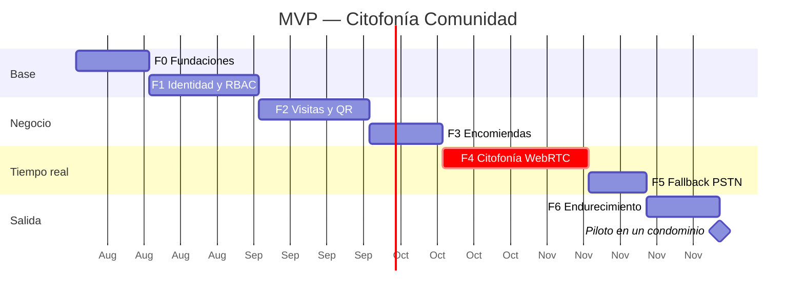

# 4. Estrategia de Implementación del MVP

## 4.1 Criterio de ordenamiento

Las fases no están ordenadas por dificultad ni por valor comercial, sino por **dependencia de seguridad**: cada fase se apoya en garantías que la anterior ya dejó verificadas. El aislamiento multi-tenant va primero porque retrofitearlo es prácticamente imposible —obliga a revisar cada consulta escrita hasta ese momento—, mientras que la citofonía va tarde porque es el módulo con más riesgo de cronograma y no debe bloquear la validación del resto del producto con usuarios reales.

Un principio que atraviesa todo el plan: **cada fase se cierra con pruebas automatizadas de sus invariantes de seguridad**, no con una revisión manual. `db/tests/security_invariants.sql` es el modelo a seguir; una garantía que no está en CI es una garantía que se pierde en tres meses.

Las duraciones asumen un equipo de 3–4 personas (2 backend, 1 móvil, 1 frontend/mixto) y son estimaciones, no compromisos.

## 4.2 Fase 0 — Fundaciones (2 semanas)

Nada de funcionalidad visible. Es la fase que más se recorta bajo presión y la que más cuesta recuperar.

- Modelo de amenazas por módulo (STRIDE): quién es el atacante en cada uno. Para citofonía, un vecino que quiere escuchar a otro. Para QR, un repartidor que quiere reutilizar un código. Para encomiendas, un conserje que quiere quedarse un paquete. Estas tres preguntas dirigen decisiones concretas de diseño.
- Infraestructura como código: VPC, subredes privadas, WAF, PostgreSQL gestionado, Redis, object storage, KMS.
- Pipeline de CI con puertas obligatorias: linter, tipos, SAST (CodeQL/Semgrep), análisis de dependencias, escaneo de secretos (gitleaks) y escaneo de imágenes. **Un hallazgo crítico rompe el build.**
- Esquema base y `db/tests/security_invariants.sql` corriendo en CI contra un PostgreSQL efímero.
- Registro de decisiones de arquitectura (ADR) para las decisiones ya tomadas: sin SFU, Ed25519 en el QR, REST antes que GraphQL.

**Cierre**: `terraform apply` reproduce el entorno desde cero y el pipeline está verde con las pruebas de aislamiento incluidas.

## 4.3 Fase 1 — Identidad, RBAC y tenancy (3 semanas)

- OAuth2/OIDC con JWT RS256 firmados por KMS, JWKS publicado y rotación por `kid`.
- Rotación de refresh tokens con detección de reuso y revocación de familia.
- MFA (TOTP) **obligatorio** para `ADMIN` y `CONSERJE`; opcional para `RESIDENTE`. La cuenta de conserjería es la más atacada del sistema: es compartida de facto entre turnos y opera desde un dispositivo fijo en el hall.
- `guards` de permisos por endpoint y middleware que fija `SET LOCAL app.condominium_id` desde el token en cada transacción.
- Alta de condominio, unidades y membresías; invitación de residentes.
- Almacenamiento seguro en cliente: Keychain (iOS) y Keystore/EncryptedSharedPreferences (Android).
- Rate limiting en Redis, por IP y por cuenta.

**Cierre**: suite de pruebas de tenancy que, por cada endpoint, intenta acceder con el token del condominio A a recursos del B y espera 403/404. Debe ser una prueba **generada** a partir de la especificación OpenAPI, no escrita a mano: sólo así cubre los endpoints que se agreguen después.

## 4.4 Fase 2 — Visitas y pases QR (3 semanas)

Primer módulo con valor de negocio, y el que permite empezar a validar con un condominio piloto.

- Firma y verificación Ed25519 de pases, con rotación de claves por `kid`.
- Emisión desde la app del residente; visualización y compartición del QR.
- Escáner de cámara en la consola de conserjería, con validación en línea y **modo degradado sin conexión** (verificación de firma local, canje diferido y reconciliación al recuperar red).
- Solicitud de ingreso desde conserjería con aprobación remota en tiempo real por WebSocket, con expiración.
- Bitácora de visitas con filtros; registro de salida.
- `audit_logs` operativo con su verificador de cadena corriendo como job diario.

**Cierre**: pruebas de canje concurrente (dos escaneos simultáneos del mismo pase → exactamente un ingreso), de pase expirado, revocado y de otro condominio. Verificación de que la cadena de auditoría resiste una carga de escritura concurrente.

**Nota sobre el modo degradado**: permite un ingreso con un pase revocado hace segundos si la portería está sin red. Es un compromiso consciente —una portería que no puede dejar entrar a nadie es inaceptable operativamente— acotado por el TTL corto de los pases y reconciliado al reconectar. Debe estar documentado para el cliente, no escondido.

## 4.5 Fase 3 — Encomiendas (2 semanas)

- Registro rápido en conserjería: transportista, seguimiento opcional, foto, unidad y destinatario. La interfaz se optimiza para **menos de 20 segundos por paquete**; si es más lenta que anotar en un cuaderno, la portería no la usará y el módulo fracasa por adopción, no por tecnología.
- Subida directa a object storage con URL prefirmada; worker que valida magic bytes, elimina EXIF y genera miniatura.
- Notificación push inmediata al residente.
- Entrega con firma en pantalla o código de retiro (comparación por HMAC, máximo 5 intentos).
- Inventario en tiempo real con filtros por fecha, unidad y estado.

**Cierre**: pruebas de la máquina de estados —incluidas las transiciones prohibidas por la base de datos— y verificación de que la subida rechaza archivos no-imagen renombrados.

## 4.6 Fase 4 — Citofonía WebRTC (4 semanas, la fase de mayor riesgo)

Cuatro semanas es una estimación optimista. El riesgo no está en WebRTC —es tecnología madura— sino en **hacer sonar el teléfono de forma confiable en dispositivos reales**.

- Servicio de señalización WebSocket con presencia por unidad.
- `coturn` desplegado con credenciales efímeras por llamada.
- WebRTC P2P con verificación de la huella DTLS firmada por el dispositivo.
- iOS: PushKit + CallKit, con `reportNewIncomingCall()` invocado **inmediatamente** al recibir el push (ver §1.5; incumplirlo hace que iOS deje de entregar pushes VoIP a la app).
- Android: FCM de alta prioridad, `fullScreenIntent`, `CATEGORY_CALL` e integración con `ConnectionService`.
- Consola de conserjería: marcación por unidad, indicador de estado, audio bidireccional.

**Cierre**: matriz de pruebas en dispositivos físicos —no emuladores— cubriendo iOS y Android recientes y antiguos, con la app en primer plano, en segundo plano, terminada, en "No molestar" y en ahorro de batería. Se prueba en las redes reales del edificio, incluyendo Wi-Fi con portal cautivo y datos móviles. Esta matriz debe re-ejecutarse **en cada versión mayor de sistema operativo**: Apple y Google cambian estas reglas con regularidad y rompen exactamente esta funcionalidad.

## 4.7 Fase 5 — Fallback PSTN (1,5 semanas)

- Integración con Twilio/Plivo, con verificación de firma de webhook y lista blanca de IP.
- Máquina de escalamiento por temporizador (8 s sin `ringing` / 20 s sin respuesta), configurable por condominio.
- **Aviso visible de línea no cifrada** en ambos extremos y registro en `calls.fell_back_to_pstn`.
- Controles de costo: tope de gasto diario por condominio, sólo destinos nacionales por omisión, alerta ante desvíos anómalos. El fraude telefónico es un riesgo real y caro; el diseño ya lo mitiga estructuralmente al derivar el número desde la base de datos y nunca desde la petición (§3.4).

**Cierre**: pruebas de la cadena de escalamiento con el residente sin red, con la app desinstalada y con el teléfono apagado.

## 4.8 Fase 6 — Endurecimiento y salida a producción (2 semanas)

- **Pentest externo** sobre el sistema completo. Presupuestar tiempo para remediar: el informe siempre trae hallazgos.
- Prueba de carga con proyección a 12 meses, incluida la escritura concurrente en `audit_logs` (la cabeza de cadena serializa por tenant y hay que confirmar que el techo por condominio es holgado).
- Runbook de incidentes: revocación masiva de tokens, rotación de claves comprometidas, restauración desde PITR.
- Ensayo de restauración de respaldos. Un respaldo que nunca se restauró no es un respaldo.
- Cumplimiento: política de privacidad, DPA con proveedores, ejercicio de derechos ARCO, revisión frente a la Ley 21.719 chilena.
- Panel de métricas de salud: entrega de push, proporción de derivaciones a PSTN, validaciones QR fallidas, roturas de cadena de auditoría.

## 4.9 Cronograma

Total aproximado: **17 semanas** hasta el piloto. Un piloto acotado puede arrancar antes: al cerrar la fase 3 ya existe un producto útil (visitas + encomiendas) que vale la pena poner en manos de un condominio real mientras se construye la citofonía.

## 4.10 Riesgos principales

| Riesgo | Impacto | Mitigación |
|---|---|---|
| Un cambio de iOS/Android rompe la notificación de llamada | Alto — el producto deja de cumplir su función principal | Matriz de dispositivos en cada versión mayor de SO; alerta sobre la tasa de derivación a PSTN como detección temprana; el fallback PSTN actúa de red de seguridad |
| Fabricantes con gestión agresiva de batería | Medio — llamadas perdidas en marcas específicas | Detección en la app con guía al usuario; fallback PSTN |
| Costos PSTN por encima de lo previsto | Medio | Topes por condominio, sólo destinos nacionales, alertas |
| El QR se comparte por captura de pantalla | Medio | TTL corto, uso único, nombre del visitante visible para cotejo, modo de alta seguridad opcional (§3.3) |
| La portería no adopta la app | **Alto — es el riesgo más subestimado** | Diseño con el conserje en terreno, medición del tiempo por operación, funcionamiento sin conexión |
| Fuga de datos entre condominios | Crítico | RLS + FK compuestas + pruebas generadas por endpoint (fase 1) |

## 4.11 Fuera del alcance del MVP

Declarado explícitamente para evitar expansión silenciosa: video en la citofonía, apertura de portones/IoT, reservas de espacios comunes, gastos comunes y pagos, llamadas grupales, y GraphQL. Todos son extensiones razonables; ninguno debe entrar antes del piloto.

Dos de ellos merecen una nota, porque cambian el modelo de seguridad y no son "más de lo mismo":

- **Apertura de portones (IoT)** convierte una vulnerabilidad de software en acceso físico al edificio. Exige su propio modelo de amenazas, un canal autenticado extremo a extremo con el controlador y una vía de apertura manual independiente del sistema.
- **Video en la citofonía** obliga a decidir entre P2P (que preserva el E2EE) y SFU (que lo rompe salvo con SFrame). Debe decidirse conscientemente, no heredarse de la librería que se elija.
